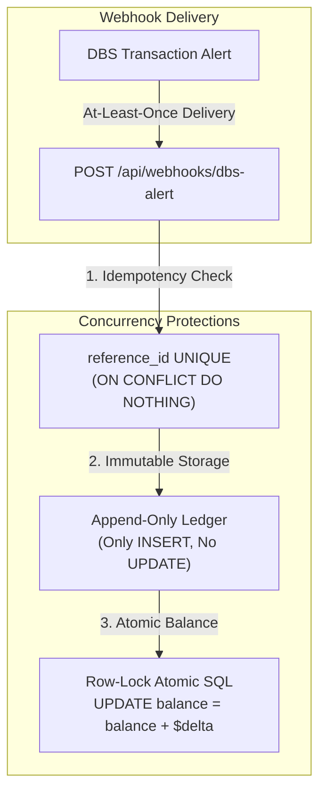
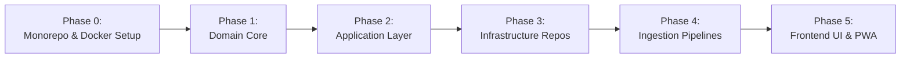

# Savings & Expense Tracker — System Design & Domain Specification

A single source of truth for architecture, domain modeling (Onion Architecture), monorepo structure, Docker orchestration, data ingestion pipelines, database schemas, and implementation roadmap.

---

## 1. Executive Summary & Goals

The goal of this application is to automate personal finance tracking across Singapore banking and investment accounts (**DBS/POSB, Standard Chartered, Interactive Brokers**), operating with zero ongoing subscription costs ($0/mo) and near real-time automated ingestion.

### Core Business Requirements
1. **Monitor all incoming & outgoing transactions**: Capture card spend, PayNow, FAST transfers, salary, and dividends.
2. **Transaction Intelligence**: Clean raw bank strings into recognizable merchants, auto-categorize expenses, and allow notes/splits.
3. **Flexible Time Aggregations**: Instant summaries of income, expenses, net savings, and savings rate sorted by **Daily**, **Weekly**, and **Monthly** intervals.
4. **Multi-Institution Consolidation**: Unify DBS, Standard Chartered, and IBKR into a single dashboard, with automatic detection of internal transfers (preventing double-counting).

---

## 2. High-Level Monorepo & System Architecture

The application is structured as a **TypeScript Monorepo** running in **Docker**, separating the system into a **NestJS Backend API** and a **React Frontend Client**.

```mermaid
flowchart TD
    subgraph HostEnvironment["Docker Compose Environment (docker-compose.yml)"]
        subgraph Backend["apps/api (NestJS Backend)"]
            L1["1. Domain Core (Entities, Money, CashFlowCalculator)"]
            L2["2. Application Layer (Use Cases & Repository Ports)"]
            L3["3. Infrastructure Layer (Supabase Adapters, DBS Regex Parsers)"]
            L4["4. Presentation Layer (REST Controllers, Webhooks, Swagger)"]

            L4 --> L3 --> L2 --> L1
        end

        subgraph Frontend["apps/web (React + Vite + Tailwind)"]
            UI["React Dashboard, KPI Cards, Recharts Analytics"]
            ApiClient["Type-safe REST API Client"]
            UI --> ApiClient
        end

        ApiClient <-->|HTTP / REST (Port 3000)| L4
    end

    subgraph Ingestion["External Ingestion"]
        Gmail["Gmail Inbox"] -->|DBS Alerts (Every 5m)| GAS["Google Apps Script"]
        GAS -->|POST /api/webhooks/dbs-alert| L4
    end

    subgraph Storage["Cloud Database"]
        L3 <-->|PostgreSQL Protocol / REST| Supabase[("Supabase (PostgreSQL Free Tier)")]
    end
```

---

## 3. Onion Architecture Inside NestJS (`apps/api`)

NestJS natively implements Onion / Clean Architecture through its **Dependency Injection (IoC)** container:

```
apps/api/src/
├── domain/                      # Layer 1: Domain Core (Zero external dependencies)
│   ├── entities/                # Transaction (Aggregate Root), Account, Category, Rule
│   ├── value-objects/           # Money (Amount + Currency)
│   ├── services/                # CashFlowCalculator, TransferDetector, MerchantNormalizer
│   └── types/                   # DateRange, Granularity ('daily' | 'weekly' | 'monthly')
│
├── application/                 # Layer 2: Use Cases & Ports (Contracts)
│   ├── ports/                   # ITransactionRepository, IAccountRepository, IAlertParser
│   └── use-cases/               # IngestAlertUseCase, GetCashFlowSummaryUseCase, ImportStatementUseCase
│
├── infrastructure/              # Layer 3: Adapters
│   ├── persistence/             # SupabaseTransactionRepository, SupabaseAccountRepository
│   └── parsers/                 # DbsEmailAlertParser, ScbCsvParser, IbkrCsvParser
│
└── presentation/                # Layer 4: REST Controllers & Webhook Handlers
    ├── controllers/             # TransactionController, AnalyticsController, WebhookController
    └── dto/                     # DTOs with class-validator & Swagger decorators
```

---

## 4. Domain Model Specification

### 4.1 Entities (Identity-Based, Managed Lifecycle)

#### 1. `Transaction` (Aggregate Root)
* **Identity**: `id: string` (UUID)
* **Fields**:
  * `accountId: string | null`
  * `money: Money` (Encapsulates amount and currency)
  * `type: TransactionType` (`'EXPENSE' | 'INCOME' | 'TRANSFER'`)
  * `rawDescription: string` (Exact string from bank alert/statement)
  * `cleanMerchant: string` (Normalized readable name, e.g. "Grab")
  * `categoryId: string | null`
  * `notes: string | null` (PayNow reference or user comment)
  * `tags: string[]` (e.g. `['#vacation', '#tax-deductible']`)
  * `status: TransactionStatus` (`'PENDING' | 'SETTLED' | 'RECONCILED'`)
  * `source: TransactionSource` (`'EMAIL_ALERT' | 'CSV_IMPORT' | 'MANUAL' | 'IBKR_API'`)
  * `referenceId: string | null` (Unique Gmail messageId or bank transaction ref)
  * `transferPairId: string | null` (Links two legs of an internal transfer)
  * `transactionDate: Date`
  * `metadata: Record<string, unknown>` (PayNow UEN, masked card, etc.)
* **Invariants & Domain Rules**:
  * A transaction cannot have an amount of zero.
  * An `EXPENSE` represents outflow (negative cash impact).
  * An `INCOME` represents inflow (positive cash impact).
  * A `TRANSFER` must not alter net cash flow across aggregated personal accounts.

#### 2. `Account` (Entity)
* **Identity**: `id: string` (UUID)
* **Fields**:
  * `name: string` (e.g. "DBS Multi-Currency", "DBS Altitude Card", "IBKR Portfolio")
  * `institution: Institution` (`'DBS' | 'SCB' | 'IBKR' | 'CASH' | 'OTHER'`)
  * `type: AccountType` (`'SAVINGS' | 'CHECKING' | 'CREDIT_CARD' | 'INVESTMENT'`)
  * `accountNumberMask: string | null` (e.g. `"1234"` — used to match bank alert emails)
  * `currency: CurrencyCode` (default `'SGD'`)
  * `currentBalance: number`
  * `color: string`
  * `isActive: boolean`

#### 3. `Category` & `CategorizationRule` (Entities)
* **`Category`**: `id`, `name`, `icon`, `color`, `type` (`'EXPENSE' | 'INCOME' | 'TRANSFER'`).
* **`CategorizationRule`**: `id`, `pattern` (e.g. `'FAIRPRICE'`), `matchField` (`'cleanMerchant' | 'rawDescription'`), `categoryId`, `priority`.

---

### 4.2 Value Objects & Pragmatic Types

* **`Money` (Value Object)**:
  * Encapsulates `amount: number` and `currency: CurrencyCode`.
  * Protects against adding different currencies without explicit exchange rate conversion.
* **`Merchant`**:
  * **Not an entity** — Avoids unnecessary tables and joins for simple personal spending. Modeled as a normalized attribute on `Transaction` (`cleanMerchant` & `rawDescription`).
* **`TimePeriod / DateRange`**:
  * **Not a heavy Value Object class** — Defined as clean TypeScript interfaces:
    ```typescript
    export type Granularity = 'daily' | 'weekly' | 'monthly';
    export interface DateRange {
      startDate: Date;
      endDate: Date;
    }
    ```

---

### 4.3 Pure Domain Services

* **`CashFlowCalculator`**:
  * Calculates financial aggregates over a given period:
    $$\text{Total Inflow} = \sum \text{Income (excluding internal transfers)}$$
    $$\text{Total Outflow} = \sum \text{Expenses (excluding internal transfers)}$$
    $$\text{Net Savings} = \text{Total Inflow} - \text{Total Outflow}$$
    $$\text{Savings Rate (\%)} = \frac{\text{Net Savings}}{\text{Total Inflow}} \times 100$$
* **`TransferDetector`**:
  * Detects when an outgoing debit on one account matches an incoming credit on another account (e.g. DBS debit of $\$1,000$ and IBKR credit of $\$1,000$ on the same date).
  * Automatically sets `transferPairId` and switches transaction type to `'TRANSFER'`.
* **`MerchantNormalizer`**:
  * Pure function stripping payment gateway prefixes (`GRAB*`, `PAYNOW TO`, `SINGAPORE SG`).

---

## 5. Ingestion Feasibility: Real DBS Email Samples

Singapore bank alert emails from DBS follow standard system templates, making regex extraction highly reliable.

### 5.1 Real-World DBS Alert Templates
1. **DBS Card Spend Alert**:
   > *"Dear Customer, an amount of **SGD 34.80** was charged to your DBS Altitude Visa Card ending with **1234** at **FAIRPRICE FINEST BUKIT TIMAH** on **26/09/2026 14:22**."*
2. **DBS PayNow Outgoing**:
   > *"Dear Customer, you have sent **SGD 12.50** from your account ending with **567-8** to **TAN AH KOW** via PayNow on **26/09/2026**. Ref: **Dinner at Hawker**."*
3. **DBS PayNow / FAST Incoming (Salary, Received Transfer)**:
   > *"Dear Customer, your account ending with **567-8** has received **SGD 4,500.00** from **ABC TECH PTE LTD** on **26/09/2026** via FAST / PayNow."*

### 5.2 Field Feasibility Matrix

| Domain Field | In DBS Email? | Extraction / Ingestion Method | Reliability |
| :--- | :---: | :--- | :---: |
| **Amount** (`34.80`) | **YES** | Regex: `/(?:SGD\|USD)\s*([\d,]+\.\d{2})/` | **100%** |
| **Currency** (`SGD`) | **YES** | Prefix match from email body (`SGD`, `USD`) | **100%** |
| **Date & Time** | **YES** | Message metadata `message.getDate()` or body regex | **100%** |
| **Account Mask** (`1234`) | **YES** | Regex: `"ending with 1234"` $\rightarrow$ Matches `Account.accountNumberMask` | **100%** |
| **Merchant Name** | **YES** | Regex: `"at <MERCHANT>"` or `"to <RECIPIENT>"` | **95%** |
| **Deduplication ID** | **YES** | Gmail `message.getId()` / DBS reference code | **100%** |
| **Transaction Type** | Inferred | `"charged to"` / `"sent to"` = `EXPENSE`; `"received from"` = `INCOME` | **100%** |
| **Category** | **NO** | Inferred via `CategorizationRule` engine. Defaults to `Uncategorized`. | **Rule-Based** |
| **Transfer Link** | **NO** | Evaluated via `TransferDetector` domain service | **Computed** |
| **Tags** (`#holiday`) | **NO** | Optional user tags added via UI | **User Input** |

> [!IMPORTANT]
> **DBS Digibank Alert Threshold**: Set transaction alert threshold to **`$0.01`** in DBS Digibank app (*More $\rightarrow$ Notifications $\rightarrow$ Manage Alerts $\rightarrow$ Alert Thresholds*) to ensure all small purchases (coffee, transport) trigger emails.

---

## 6. Monorepo Directory Structure

```
savings-tracker/
├── docker-compose.yml              # Local orchestration (API + Web)
├── package.json                    # Root npm workspace: { "workspaces": ["apps/*"] }
├── tsconfig.base.json              # Shared TypeScript compiler options
├── SYSTEM_DESIGN.md                # System design & architecture blueprint
│
├── apps/
│   ├── api/                        # NestJS Backend Application (Port 3000)
│   │   ├── Dockerfile
│   │   ├── src/
│   │   │   ├── domain/             # Layer 1: Core Entities, Value Objects, Services
│   │   │   ├── application/        # Layer 2: Use Cases & Repository Ports
│   │   │   ├── infrastructure/     # Layer 3: Supabase Repositories, DBS Email Parsers
│   │   │   └── presentation/       # Layer 4: REST Controllers, Webhook Handlers, DTOs
│   │   └── package.json
│   │
│   └── web/                        # React Frontend Application (Port 5173)
│       ├── Dockerfile
│       ├── src/
│       │   ├── components/         # KPI Cards, Recharts, Transaction Table
│       │   ├── hooks/              # Data fetching hooks
│       │   └── pages/              # Dashboard, Accounts, Transactions
│       └── package.json
```

---

## 7. Open-Source Libraries & Technical Choices

| Purpose | Selected Library | Rationale |
| :--- | :--- | :--- |
| **Validation & Schemas** | `zod` | Schema-first type safety (`z.infer`), runtime invariant checks, zero decorator baggage in Domain Core. |
| **NestJS + Zod Bridge** | `nestjs-zod` | Seamlessly bridges Zod with NestJS; auto-generates Swagger/OpenAPI documentation directly from Zod schemas with `createZodDto`. |
| **Financial Precision** | `currency.js` | Prevents floating-point math errors (`0.1 + 0.2 !== 0.3`) by executing arithmetic in integer cents internally. Used inside `Money` value object. |
| **Timezone & Date Math** | `date-fns` + `date-fns-tz` | Guarantees deterministic Singapore Time (**SGT / Asia/Singapore - UTC+8**) date aggregation across Daily, Weekly, and Monthly charts. |
| **Bank Statement CSV** | `papaparse` | Streaming, memory-safe CSV parsing for DBS historical statements, Standard Chartered, and IBKR files. |
| **Frontend State & Cache**| `@tanstack/react-query` | Automatic background refetching, client-side caching, and optimistic updates. |
| **Visualizations** | `recharts` | Composable SVG financial charts for cash flow trends and category distribution. |

---

## 8. Concurrency, Idempotency & Race Condition Prevention

### Concurrency Risk Analysis & Architectural Decision
* **Temporal.io Evaluation**: Evaluated Temporal for workflow orchestration and decided **against** it. Temporal requires heavy multi-server infrastructure (gRPC cluster, Cassandra/PostgreSQL persistence, Elasticsearch) which is massive overkill for a personal tracker and does not natively solve database-level concurrency.
* **Architecture Strategy**: We achieve 100% race-condition and duplicate-write immunity using three database-level and architectural guarantees:



### The 3 Pillars of Concurrency Safety:
1. **Database-Level Idempotency (`reference_id UNIQUE`)**:
   * Every bank alert has a unique reference (Gmail `messageId` or DBS transaction ref).
   * Ingestion uses PostgreSQL's native `ON CONFLICT (reference_id) DO NOTHING`. Even if 5 network retries hit the server at the exact same millisecond, exactly one row is inserted and duplicates are safely ignored.
2. **Append-Only Ledger (Immutability)**:
   * Transactions are strictly appended. An immutable append-only ledger eliminates write-write race conditions.
3. **Atomic Balance Updates & Derived Balances**:
   * Current account balance is computed on demand via `SELECT SUM(amount) FROM transactions WHERE account_id = $id` or updated atomically via `UPDATE accounts SET current_balance = current_balance + $delta` which places an immediate row-level write lock in PostgreSQL.
* *(Optional future extension: If asynchronous background webhook queuing is desired, `pg-boss` will be used as a lightweight queue running directly inside the existing PostgreSQL database with zero additional servers).*

---

## 9. Phased Implementation Roadmap



### 🟩 Phase 0: Monorepo & Docker Setup
* [x] Restructure repository into `apps/api` and `apps/web`.
* [x] Initialize NestJS in `apps/api` and move React into `apps/web`.
* [x] Configure root `package.json` with npm workspaces.
* [x] Add `Dockerfile` for both apps and root `docker-compose.yml`.

### 🟩 Phase 1: Domain Core Modeling (`apps/api/src/domain`)
* [x] Implement `Money` value object with arithmetic and currency safety.
* [x] Implement `Transaction` and `Account` entities with business invariants.
* [x] Implement `CashFlowCalculator` domain service (Daily, Weekly, Monthly rollups, savings rate).
* [x] Implement `MerchantNormalizer` domain service.
* [x] Write automated unit tests for domain entities and services (Vitest / Jest).

### 🟩 Phase 2: Application Layer (`apps/api/src/application`)
* [ ] Define repository port interfaces (`ITransactionRepository`, `IAccountRepository`).
* [ ] Implement `IngestAlertUseCase` (takes draft, matches account mask, applies rule, commits).
* [ ] Implement `GetCashFlowSummaryUseCase` (handles daily/weekly/monthly queries).
* [ ] Implement `TransferDetector` orchestration.

### 🟩 Phase 3: Infrastructure Adapters (`apps/api/src/infrastructure`)
* [ ] Set up Supabase project and execute PostgreSQL schema.
* [ ] Implement `SupabaseTransactionRepository` and `SupabaseAccountRepository`.
* [ ] Create in-memory mock repository adapter for fast local testing.

### 🟩 Phase 4: Ingestion Adapters & Webhooks
* [ ] Implement `DbsEmailAlertParser` adapter (regex matching Card alerts, PayNow, FAST).
* [ ] Expose NestJS Webhook endpoint: `POST /api/webhooks/dbs-alert`.
* [ ] Deploy Google Apps Script to poll Gmail and trigger the webhook.
* [ ] Implement CSV parser adapters for Standard Chartered and IBKR statements.

### 🟩 Phase 5: Presentation Layer (`apps/web`)
* [ ] Build KPI Cards (Income, Expense, Net Savings, Savings Rate %).
* [ ] Build Time-series charts (Daily, Weekly, Monthly view toggles using Recharts).
* [ ] Build Unified Transaction Ledger with search, filter, and category editing.
* [ ] Configure PWA manifest for home-screen mobile access.
